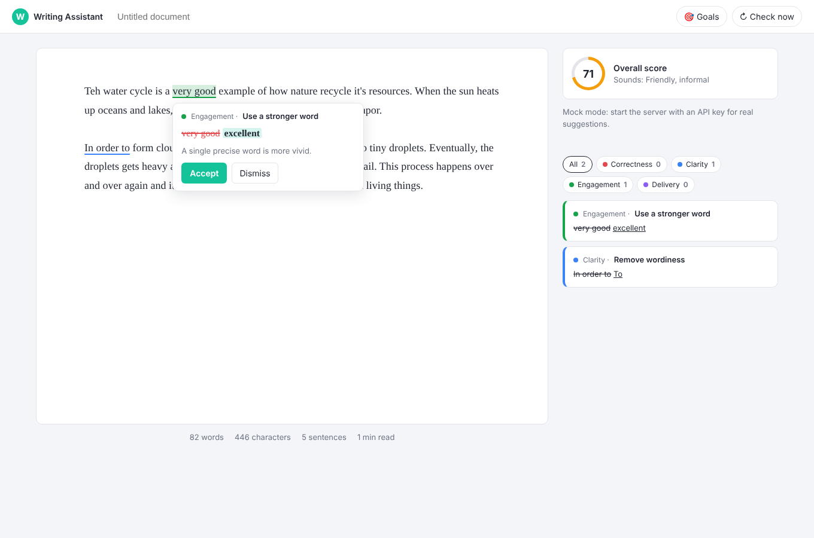

# AI Writing Assistant ✍️

A Grammarly-style editor where you write together with AI (Claude). Type or paste your text and you get:

- **Inline underlines** while you type, colour-coded like Grammarly:
  🔴 Correctness · 🔵 Clarity · 🟢 Engagement · 🟣 Delivery
- **Suggestion cards** in the sidebar. Click a card or an underlined word to see the change and a short explanation, then **Accept** or **Dismiss**. You can also accept all correctness fixes at once.
- **An overall score and tone** ("Sounds: confident, friendly").
- **AI rewrite on any selection.** Select text and a toolbar appears with *Improve*, *Shorten*, *Simplify* (for a 10-year-old), *Formal*, *Friendly*, or your own instruction. You can preview the result, then replace the selection or insert the result below it.
- **Goals** (audience, formality, domain, intent) that change the feedback. For example, choose *Young students* when you write for a class.
- Native **undo** (Ctrl/Cmd+Z) works after you accept a suggestion. Your document is autosaved in the browser.



## Run it

Requires Node.js 18+ and an [Anthropic API key](https://console.anthropic.com/).

```bash
cd apps/ai-writing-assistant
npm install
ANTHROPIC_API_KEY=sk-ant-... npm start
# open http://localhost:3000
```

To try the interface without a key, run `npm run mock`. Mock mode uses a few canned rules instead of AI.

Optional environment variables:

| Variable | Default | Purpose |
|---|---|---|
| `PORT` | `3000` | Port the server listens on |
| `CLAUDE_MODEL` | `claude-opus-5-5` | Claude model used for checks and rewrites |
| `MOCK` | unset | Set to `1` for offline mock mode |

## How it works

```
public/index.html   Editor page (top bar, editor, sidebar, AI toolbar, goals dialog)
public/styles.css   Grammarly-like styling (light and dark)
public/app.js       Editor logic: underlines, cards, accept/dismiss, AI rewrite
server.js           Node server: serves the page and calls Claude
```

- **Editor.** A transparent `<textarea>` sits on top of a "backdrop" div that mirrors the text and draws the coloured underlines. This keeps typing, selection and undo native and reliable.
- **`POST /api/check`** sends the text and your goals to Claude, which returns structured JSON (a score, a tone, and a list of `{category, original, replacement, explanation}`). The browser finds each `original` phrase in the text and underlines it. While you type, underlines shift with the text. About 2 seconds after you stop typing, the text is checked again.
- **`POST /api/rewrite`** rewrites only the selected passage and sends the whole document along for context.
- Your API key stays on the server and is never sent to the browser.
